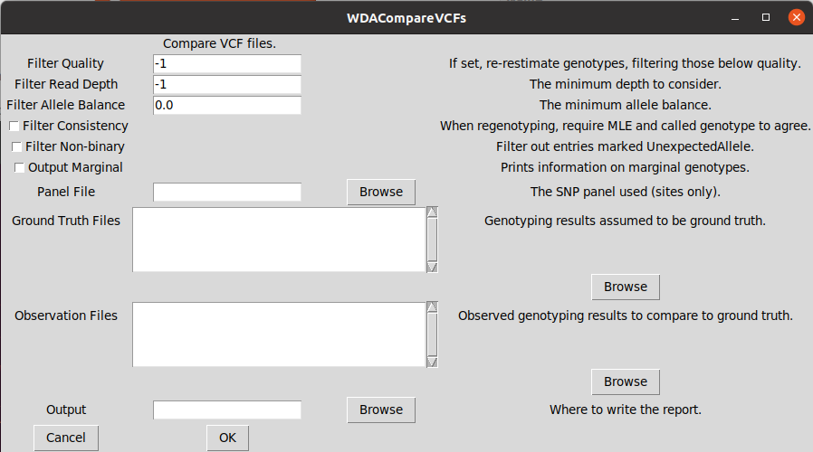

# Summary

whodunargs is two pieces.
The first is a library for the specification and parsing of command line arguments.
The second piece is a tool to take that specification and automatically perform several tasks.
The most important task is generating and displaying a GUI to allow less-technical users to use scientific software.

# Statement of need

There are many pros to a command line interface: it excels at tasks requiring automation, and skilled users can use it to very quickly achieve their goals.
However, GUIs have dominated the landscape of personal computing for over 25 years: there are many potential users of scientific software for whom the command line is wholly foreign.
Moreover, even among more technical users, navigating the documentation of an unfamiliar tool can prove surprisingly challenging (especially if English is not your native tongue).
A GUI can be a useful fallback.

It's easy to say all software should have a GUI: however, there are several challenges to doing so.
First, GUI programming invokes a set of paradigms with which many (even many excellent) programmers are unfamiliar.
Second, many important programming languages (C) do not come with GUI support in their standard library, requiring either linking with an external library or writing platform specific code ([@microsoft1992microsoft],[@scheifler1986x]).
Third and, perhaps most importantly, adding GUI support to a program requires effort that is typically tangential to the main goals of the software.

However, in the common case, the types of the command line arguments correspond directly to a standard GUI element (e.g. a boolean flag corresponds to a checkbox, an enumeration invokes a radio button).
In most cases, if the programmer of a piece of software can specify those types, it should be possible to automatically build a GUI: this is exactly what whodunargs allows.
The figure shows an example of such a GUI for a utility for generating a confusion matrix by comparing the contents of two sets of variant call files [@danecek2011variant]: the sort of small utility that might never see any GUI support without a tool like whodunargs.

whodunargs can also produce various types of documentation: building documentation automatically can minimize any differences with program behavior.
Note that the main documentation on Github was produced in this manner.

# References

